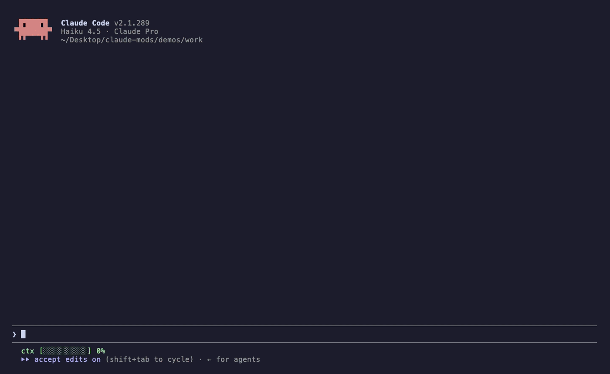
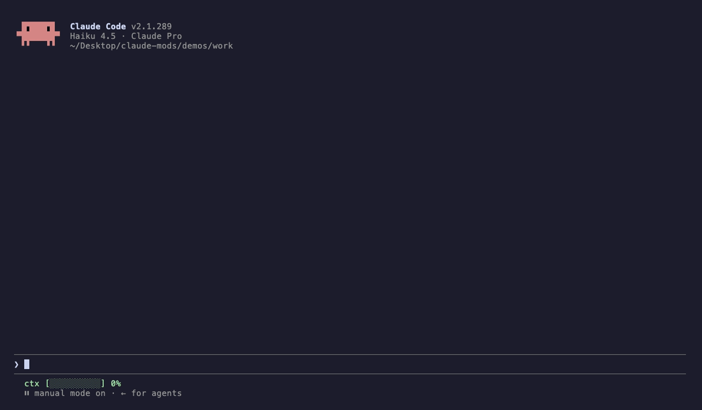

# claude-mods

Four mods for [Claude Code](https://code.claude.com), built on Claude Mods (function hooks, early access). Every demo below is a real, unedited Claude Code session.

| Mod | In one line |
|---|---|
| [**teach-me**](#teach-me) | Learn while Claude codes: a question about each change it makes, scored per concept |
| [**vhs**](#vhs) | A tape of every edit: watch changes replay, rewind any file to any step |
| [**frugal**](#frugal) | Helper agents on Haiku, big files summarised by a free Gemini model |
| [**lofi**](#lofi) | A soundtrack that follows the session, with original music |

## teach-me and vhs



Claude adds a cache. **teach-me** asks why (in Hinglish here; English is a setting), `/a 1` answers it. Claude adds an expiry. **`/vhs`** opens the tape and replays the change.

### teach-me

After a turn that changed code, Haiku writes one multiple-choice question about **that exact change**: the idea behind it, not trivia. It sits above the prompt until you answer. Scores are kept per concept, so `/teach stats` tells you what to revise.

- `/a 1-4` answer, `/a skip` see the answer
- `/teach stats` your weak spots, `/teach now` a question about the last change, `/teach on` / `off`
- Settings: quiz language (Hinglish or English), model (Haiku), minutes between questions (4)

Built for the way a lot of us code now: the agent writes it, you have to understand it.

### vhs

Every Edit and Write is snapshotted before and after, so each file has its versions in order. `/vhs` opens a pane that replays them: the diff is computed line by line (unchanged lines stay context, as in git) and new lines type themselves in.

- `h` / `l` step, `p` play or pause, `f` next file, `r` twice rewinds the file to the step on screen (the rewind is taped too), `c` close
- `/vhs list`, `/vhs <file>`, `/vhs close`

## frugal



Two ways to spend Claude on thinking instead of chores:

1. **Helper subagents** (Explore and friends) that don't ask for a model run on Haiku.
2. **`summarize_free`**, a tool Claude can call to hand a big file or log to a free Gemini model and get back only what it needs. Gemini models are tried in order (Lite first), so one being busy doesn't stop it.

A line above the prompt counts what went where; `/frugal status` adds the all-time totals.

An honest note from making the demo: for "find the error" questions Claude reaches for Grep, which is cheaper still. `summarize_free` earns its place on summaries, timelines and questions grep can't answer, or whenever you ask for it.

Needs a free key from [aistudio.google.com](https://aistudio.google.com): set `GEMINI_API_KEY`, or `claude plugin configure frugal` (stored in secure storage).

## lofi

**[▶ Watch with sound](demos/lofi.mp4)** (30 s)

A soundtrack that follows the session: **calm** while Claude is idle, **focus** while it works, **flow** when it's editing hard (3 edits inside a minute); a chime when a test command passes, a low note when it fails, a chord when a long turn finishes, then silence after a few idle minutes. Off until `/lofi on`.

Every sound is original: synthesised from scratch by [`plugins/lofi/scripts/make_audio.py`](plugins/lofi/scripts/make_audio.py) (Rhodes-style chords, swung drums, vinyl crackle), so there is nothing to license.

- `/lofi on` / `off`, `/lofi vol 0-100`, `/lofi status`

## Install

Mods need Claude Code 2.1.273 or newer, with function hooks turned on:

```bash
export CLAUDE_CODE_ENABLE_FUNCTION_HOOKS=1
claude plugin marketplace add saksham10arora-dotcom/claude-mods
claude plugin install teach-me@nerfsaksham-mods
claude plugin install vhs@nerfsaksham-mods
claude plugin install frugal@nerfsaksham-mods
claude plugin install lofi@nerfsaksham-mods
```

Every option has a default, so the installer's "userConfig options not yet set" note is safe to ignore; change them any time with `/plugin configure <mod>@nerfsaksham-mods`.

Or try one without installing:

```bash
git clone https://github.com/saksham10arora-dotcom/claude-mods && cd claude-mods
CLAUDE_CODE_ENABLE_FUNCTION_HOOKS=1 claude --plugin-dir plugins/vhs
```

## What each mod touches

From `claude plugin validate`, which reads each mod the way the engine will:

| Mod | Reads and writes |
|---|---|
| teach-me | its own store; one Haiku call per question |
| vhs | the files Claude edits (read before and after; written only when you press `r` twice) |
| frugal | the file you ask it to summarise; one call to Gemini; `GEMINI_API_KEY` |
| lofi | its own audio files, played through the system player |

## Develop

```bash
CLAUDE_CODE_ENABLE_FUNCTION_HOOKS=1 claude plugin validate plugins/<mod>
CLAUDE_CODE_ENABLE_FUNCTION_HOOKS=1 claude plugin test plugins/<mod>
```

18 tests across the four. The demos are [vhs](https://github.com/charmbracelet/vhs) tapes: `demos/setup.sh`, then `vhs demos/learn.tape` from `demos/` (the header of each tape has the exact command).

Claude Mods are early access: the API may change between Claude Code releases, and these were built against 2.1.286.

MIT. Made by [Saksham Arora](https://saksham.digital) ([@nerfsaksham](https://x.com/nerfsaksham)).
